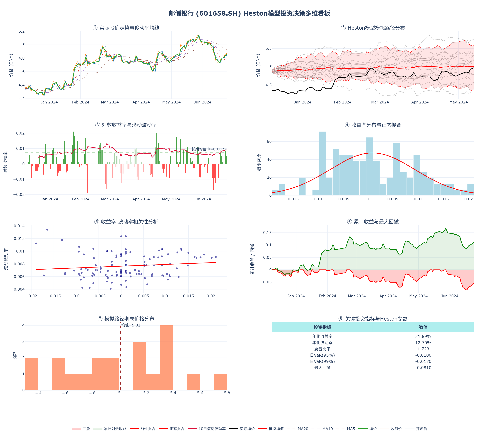
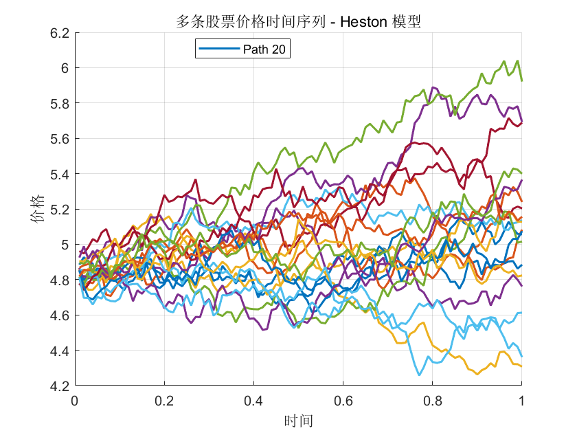

# Heston 金融时间序列生成模型

基于 **Heston 随机波动率模型** 的股票价格模拟与投资决策可视化分析。

本项目以邮储银行 (601658.SH) 的历史股价数据为例，使用 MATLAB 和 Python 双版本实现了 Heston 模型的参数估计与蒙特卡洛路径模拟，并构建了一个交互式的多维投资决策看板。

---

## 📁 项目结构

```
.
├── src/                           # 源代码
│   ├── heston_model.py            # Python 版 Heston 模型实现
│   ├── heston_model.m             # MATLAB 版 Heston 模型实现
│   └── investment_dashboard.py    # Plotly 交互式投资决策看板
├── notebooks/                     # Jupyter Notebook
│   └── heston_model.ipynb         # 可交互的模型演示
├── data/                          # 原始数据
│   └── stock_price.xlsx           # 邮储银行历史股价数据
├── results/                       # 输出结果
│   ├── heston_simulation_paths.csv    # 模拟价格路径
│   ├── dashboard_summary.txt          # 关键指标汇总
│   ├── investment_dashboard.html      # 交互式 HTML 看板
│   ├── investment_dashboard.png       # 静态看板截图
│   └── 股票价格时间序列.png            # 模拟路径可视化
├── README.md
└── requirements.txt
```

---

## 🚀 快速开始

### 1. 克隆仓库

```bash
git clone https://github.com/yourusername/Heston-Financial-Time-Series.git
cd Heston-Financial-Time-Series
```

### 2. 安装依赖

```bash
pip install -r requirements.txt
```

### 3. 运行模型

**Python 版本：**
```bash
cd src
python heston_model.py
python investment_dashboard.py
```

**MATLAB 版本：**
```matlab
cd src
run heston_model.m
```

---

## 📊 核心功能

- **参数估计**：从真实股价数据估计 Heston 模型五大参数（κ, θ, σᵥ, ρ, v₀）
- **蒙特卡洛模拟**：生成多条未来股票价格路径
- **风险指标计算**：年化收益率、波动率、夏普比率、VaR、最大回撤
- **交互式看板**：使用 Plotly 生成 8 个子图的综合投资分析面板（HTML + PNG）

---

## 📷 结果展示

### 投资决策多维看板

运行 `investment_dashboard.py` 后生成的综合看板，包含实际股价走势、Heston 模拟路径、滚动波动率、收益率分布、相关性分析、累计收益与回撤、期末价格分布及关键投资指标：



### Heston 模型模拟路径

基于估计参数生成的 20 条股票价格蒙特卡洛模拟路径：



---

## 📈 Heston 模型参数示例

| 参数 | 含义 | 估计值 |
|------|------|--------|
| κ | 均值回归速度 | 0.1011 |
| θ | 波动率长期均值 | 0.0077 |
| σᵥ | 波动率的波动率 | 0.0019 |
| ρ | 收益率-波动率相关系数 | 0.1795 |
| v₀ | 初始波动率 | 0.0077 |

---

## 🛠 技术栈

- **Python**: `pandas`, `numpy`, `matplotlib`, `scipy`, `plotly`
- **MATLAB**: Financial Toolbox (基础函数)
- **数据**: Excel 历史股价数据

---

## 📄 许可证

本项目仅供学习和研究使用。
